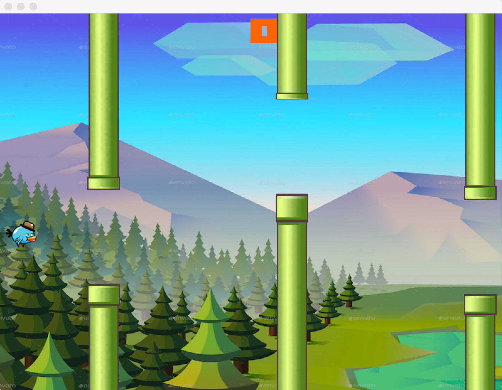

# flappy gopher

A flappy bird clone made in go.

Based on [this video](https://www.youtube.com/watch?v=aYkxFbd6luY) and [this project](https://github.com/campoy/flappy) by [Francesc Campoy](https://github.com/campoy), also [this project](https://github.com/shabinesh/flappy) by [Sab](https://github.com/shabinesh)
